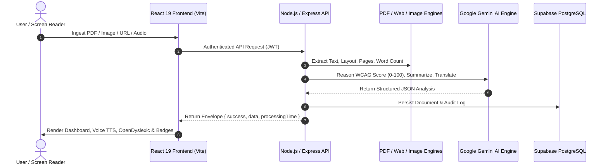

# 🌐 ascess-1-ai — Universal AI & Accessibility Engine

> **Production-Ready Enterprise AI & Accessibility Platform for Universal Inclusion**

[](#technology-stack)
[](#accessibility-features)
[](#license)

---

## 📌 Problem Statement

Over **1 billion people worldwide** experience disability, visual impairment, dyslexia, cognitive reading challenges, or language barriers. Most digital applications suffer from:
1. **Inaccessible Document Formats**: Unstructured PDFs and images lacking alt text or screen-reader landmarks.
2. **Cognitive Overload**: Complex vocabulary and dense jargon hindering comprehension for dyslexic or elderly users.
3. **WCAG Compliance Gaps**: Web pages lacking contrast, ARIA landmarks, focus rings, or voice navigation.

---

##💡 Solution Overview

**`ascess-1-ai`** is a unified, production-ready AI Accessibility Engine combining **Google Gemini AI 2.0**, multi-format document ingestion, automated WCAG 2.1 AA/AAA auditing, Web Speech voice synthesis & recognition, OpenDyslexic legibility mode, and multi-language translation.

---

## 🏗️ System Architecture



---

## ⭐ Feature Matrix

| Feature Module | Capabilities |
| :--- | :--- |
| **🤖 Gemini AI Copilot** | Context-aware AI chat, streaming typing, markdown code blocks, document Q&A tutor |
| **📁 Smart Ingestion** | PDF (`pdf-parse`), Website Scraper (`cheerio`), Image OCR, Plain Text / Markdown |
| **📊 WCAG Audit Platform** | 0-100 Smart Scoring across 7 pillars, 5-tier Priority Engine (`Critical` to `Info`), Achievement Badges |
| **🎙️ Voice Reader Studio** | Browser Web Speech TTS (play, pause, speed 0.5x–2.0x, pitch, sentence tracking, progress %) |
| **🎤 Voice Commands & STT** | Voice navigation (*"Read page"*, *"Translate to Telugu"*, *"Go to Dashboard"*), Speech-to-Text input |
| **🔤 OpenDyslexic & Legibility** | OpenDyslexic font mode, letter/word spacing, soft background tint, mouse-following Reading Ruler |
| **🌓 High Contrast Theme** | High Contrast Mode (`high-contrast-mode`), black & yellow AAA contrast, 3px focus rings |
| **🌐 Multi-Language Translation** | Translate into 14 languages (Telugu, Hindi, Tamil, Kannada, Malayalam, Marathi, Urdu, Spanish, French, German, Japanese, Chinese, Arabic) |
| **📥 Multi-Format Exporter** | Export full WCAG reports into **PDF**, **JSON**, **Markdown**, or **TXT** |
| **♿ Accessibility Dock** | Floating collapsible toolbar dock on all pages (`?` for Keyboard Shortcuts modal) |

---

## 🛠️ Technology Stack

- **Frontend**: React 19, Vite, React Router DOM v7, Tailwind CSS, Material UI, Framer Motion, React Icons, Context API, Web Speech API (`speechSynthesis`, `SpeechRecognition`).
- **Backend**: Node.js, Express.js, Google Gemini SDK (`@google/generative-ai`), `pdf-parse`, `cheerio`, Multer, Helmet, CORS, Morgan, CookieParser, Zod, bcrypt, JWT.
- **Database**: Supabase PostgreSQL with RLS Policies & fallback in-memory store.

---

## 📂 Folder Structure

```text
ascess-1-ai/
├── backend/
│   ├── src/
│   │   ├── ai/               # Gemini client & PromptBuilder
│   │   ├── audit/            # ScoringService, PriorityEngine, ExportService
│   │   ├── controllers/      # Express controllers
│   │   ├── document/         # PDFProcessor, WebsiteProcessor, ImageProcessor
│   │   ├── middleware/       # Auth, Upload, RateLimit, Error, Validation
│   │   ├── routes/           # Auth, User, AI, Document, Accessibility, History
│   │   ├── services/         # AIService, DocumentService, AccessibilityAuditService
│   │   ├── supabase/         # Queries & Database fallback
│   │   └── app.js
│   ├── .env.example
│   └── package.json
├── frontend/
│   ├── src/
│   │   ├── components/       # Accessibility, UI, Forms, Layout, Dashboard
│   │   ├── context/          # Auth, Theme, Settings, Sidebar, Notification, Accessibility
│   │   ├── hooks/            # useTextToSpeech, useSpeechToText, useAuth, useLogin
│   │   ├── pages/            # Dashboard, AI, Upload, Accessibility, Translation, Voice, History, Settings, Profile
│   │   ├── routes/           # AppRouter, ProtectedRoute, GuestRoute
│   │   └── services/         # AI, Document, Accessibility, User services
│   ├── vercel.json
│   └── package.json
├── README.md
├── DEMO_SCRIPT.md
└── PRESENTATION.md
```

---

## 🚀 Quick Start & Local Setup

### Prerequisites
- Node.js >= 18.x
- npm >= 9.x

### 1. Backend Setup
```bash
cd ascess-1-ai/backend
npm install
cp .env.example .env
# Fill GEMINI_API_KEY in .env
cmd /c npm run dev
```
*(Backend runs on `http://localhost:5000`)*

### 2. Frontend Setup
```bash
cd ascess-1-ai/frontend
npm install
cmd /c npm run dev
```
*(Frontend runs on `http://localhost:5173`)*

---

## 🔑 Environment Variables

### Backend (`ascess-1-ai/backend/.env`)
```env
PORT=5000
NODE_ENV=development
JWT_SECRET=ascess_1_ai_super_secret_jwt_key_2026_hackathon
JWT_EXPIRES_IN=7d
SUPABASE_URL=https://your-supabase-project-id.supabase.co
SUPABASE_ANON_KEY=your-supabase-anon-key
SUPABASE_SERVICE_ROLE_KEY=your-supabase-service-role-key
GEMINI_API_KEY=AIzaSy... (Your Google Gemini API Key)
```

---

## 📄 License & Team

- **License**: MIT License
- **Team**: Hackathon Submission 2026
